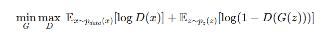
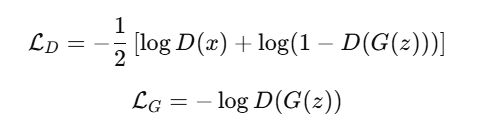
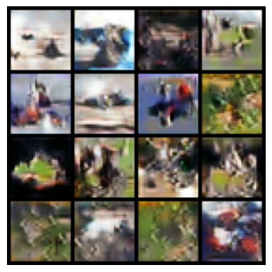

# Generative Adversarial Networks (GAN) on CIFAR-10
> This project implements a simple Generative Adversarial Network (GAN) trained on the CIFAR-10 dataset using PyTorch. The aim is to explore the core mathematical intuition of GANs and build a functioning pipeline from data loading to image synthesis.

# 🌱 Project Motivation
Generative Adversarial Networks (GANs), introduced by Ian Goodfellow in 2014, offer a powerful framework for data generation through adversarial learning. Two neural networks, a Generator (G) and a Discriminator (D), are pitted against each other:
- G tries to create fake data that is indistinguishable from real data.
- D tries to classify inputs as real (from dataset) or fake (from G).

This zero-sum game leads to a minimax optimization process:

# 📦 Dataset: CIFAR-10
- Source: Downloaded using torchvision.datasets.
- Format: 32x32 color images across 10 categories.
- Preprocessing:
    - Converted to tensors
    - Normalized to [-1, 1] (matching Tanh output from generator)

# 🧠 Model Architecture
**Generator (G)**
Input: Random vector z ∈ ℝ^{100} sampled from standard normal distribution.

Output: Synthetic RGB image x_fake ∈ ℝ^{3×32×32}

Components:
- Fully connected layer + reshape
- Two upsampling blocks with Conv2D + BatchNorm + ReLU
- Final layer: Conv2D + Tanh to output image

**Discriminator (D)**
Input: Real or generated image

Output: Probability that image is real ∈ [0, 1]

Components:
- Four Conv2D layers with LeakyReLU, BatchNorm, and Dropout
- Flatten + Linear(256×5×5 → 1) + Sigmoid

# 🔢 Loss Function
Binary Cross-Entropy (BCE) is used for both G and D.

# 🔁 Training Loop
- Discriminator Update:
    - Minimize loss on distinguishing real vs fake images.
    - real_loss = BCE(D(real), 1)
    - fake_loss = BCE(D(G(z)), 0)
    - D_loss = (real_loss + fake_loss) / 2

- Generator Update:
    - Minimize loss to fool discriminator.
    - G_loss = BCE(D(G(z)), 1)

# 🧪 Visualization result

# 💡Reference
Link paper: [Generative Adversarial Networks](https://arxiv.org/abs/1406.2661)

!update: will add Conditional GAN, training on progress